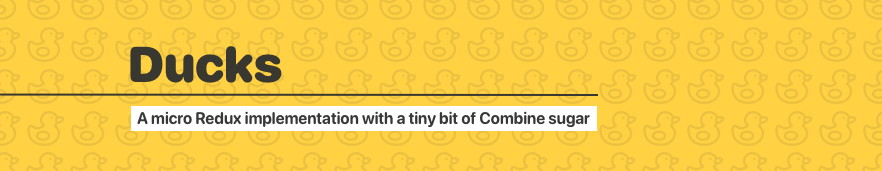

- - - -
[](https://app.bitrise.io/app/06e35f68b2f0e2e1)

---


## Getting Started
Ducks supports installation through SPM on iOS 13, macOS 10.15, tvOS & watchOS.

Simply add Ducks to your package manifest.

```swift
dependencies: [
    .package(url: "https://github.com/alexLittlejohn/ducks.git", from: "1.0.0")
]
```

## To Do Example
Once you’ve added Ducks to your project simply import it.

```swift
import Ducks
```

Start by creating a state to represent your app. In this example we will create a todo list .

Let’s begin by creating our TodosState.  This is the representation of our apps current state as it holds the list of ToDo models.

```swift
struct TodosState: StateType {
	let todos: [ToDo]
}
```

We will also need a simple data model representing a ToDo

```swift
struct ToDo: Equatable {
	let name: String
  let complete: Bool
}
```

Now that we are done modelling our data, let’s take a moment to think about the types of actions we could perform on a to do list. The first that comes to mind is the ability to create a task as well as mark one as complete. This should be enough to get us going. To describe our actions we can use a simple enum to represent them.

```swift
enum ToDoActions: Action {
	case create(String)
  Case markAsComplete(ToDo)
}
```

We have completed describing our app state as well as the actions for that state. We now need to glue these together with a reducer. A reducer is a core concept of the Redux state machine. It is described as a function like so `(action, currentState) -> newState`. Reducers are the only place where we should perform mutations on our state. This helps us to maintain the unidirectional data flow. 

```swift
let todoReducer: Reducer<ToDosState> = { action, state in
	switch action:
	case ToDoActions.create(let name):
    var todos = state.todos
	  todos.append(ToDo(name: name, complete: false))
	  return ToDosState(todos: todos)
  case ToDoActions.markAsComplete(let todo):
    var todos = state.todos
	  if let idx = todos.index(of: todo) {
      todos.remove(at: idx)
      todos.append(ToDo(name: todo.name, complete: true))
    }
    return ToDosState(todos: todos)
} 
```

Now that we’ve created all the necessary components for our state machine lets glue it all together with a Store.

```swift
let store = Store(
  reducer: todoReducer, 
  state: TodosState(todos: [])
)
```

